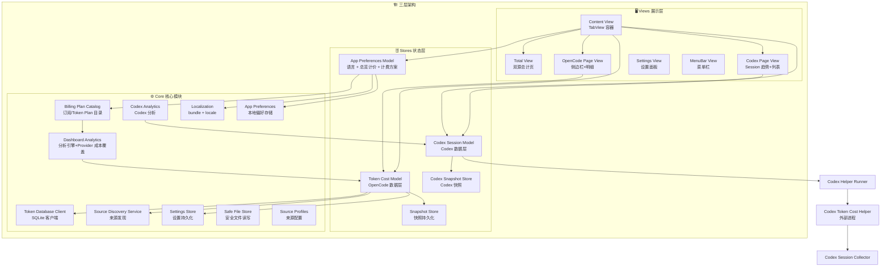
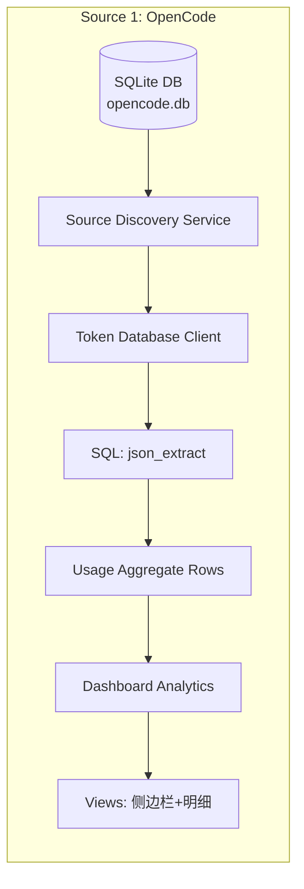
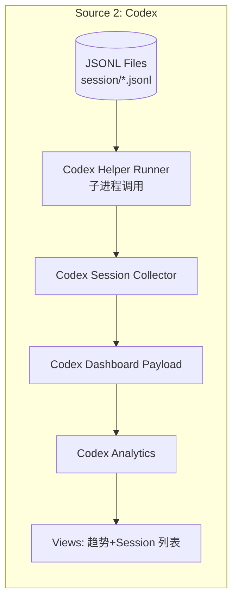
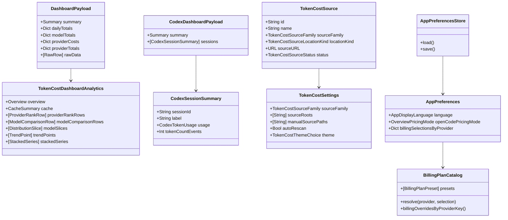

# 架构逻辑链图

## 系统全景架构



## 双数据源流





## 数据模型层级



## UI 导航树

```
Token Cost App (@main)
├── TabView: ContentView
│   ├── Tab: 总计 → TotalView
│   │   ├── Overview Settings: OpenCode 计价切换 + 选定订阅方案摘要
│   │   └── Cards: OpenCode合计 | Codex合计 | 总成本 | 总Token
│   │
│   ├── Tab: opencode → OpenCodePageView
│   │   └── NavigationSplitView
│   │       ├── Sidebar: SidebarView
│   │       │   ├── 来源列表 (TokenCostSource rows)
│   │       │   └── 状态指示器
│   │       └── Detail: DetailView
│   │           ├── 总览 (Overview)
│   │           ├── 每日趋势 (Trend Chart)
│   │           ├── 缓存分析 (Cache Section)
│   │           ├── Provider 排行 (Ranking)
│   │           ├── 模型对比 (Model Comparison)
│   │           ├── 分布图 (Pie Charts)
│   │           ├── 每日堆叠 (Stacked Bar)
│   │           └── 明细表 (Detail Table)
│   │
│   └── Tab: codex → CodexPageView
│       ├── 总览卡片
│       ├── 每日趋势 (Trend Chart)
│       └── Session 列表 (分页+排序)
│
├── Settings → SettingsView
│   ├── 全局偏好 (语言 + OpenCode 总览计价)
│   ├── 计费方案 (Provider 官方预设 + DIY USD/月费 + 定价文档入口)
│   ├── 主题 (4色主题选择)
│   ├── OpenCode 来源 (扫描配置)
│   └── Codex 来源 (session 目录/文件)
│
└── MenuBar → MenuBarView
```

## 关键文件索引

| 文件 | 职责 | 行数 |
|------|------|------|
| `Models.swift` | TokenCost 核心数据模型 | 386 |
| `CodexModels.swift` | Codex session 数据模型 | 160 |
| `DashboardAnalytics.swift` | OpenCode 分析引擎 + 模型定价表 | 819 |
| `CodexAnalytics.swift` | Codex 分析引擎（趋势/排序） | 222 |
| `AppPreferences.swift` | 全局偏好、计费选择和本地持久化 | 新增 |
| `BillingPlanCatalog.swift` | Provider 订阅 / Token Plan 目录和自定义费用解析 | 新增 |
| `Localization.swift` | 本地化 bundle 解析与文本格式化 | 新增 |
| `TokenDatabaseClient.swift` | SQLite 直连查询 | 379 |
| `SourceDiscoveryService.swift` | 文件系统扫描发现来源 | 209 |
| `CodexSessionCollector.swift` | JSONL session 解析器 | 607 |
| `TokenCostModel.swift` | OpenCode 数据 Store | 328 |
| `CodexSessionModel.swift` | Codex 数据 Store | 641 |
| `AppPreferencesModel.swift` | 全局偏好状态桥接 | 新增 |
| `SettingsStore.swift` | 设置 + 快照持久化 | 127 |
| `SafeFileStore.swift` | 安全沙箱内文件操作 | 84 |
| `DetailView.swift` | 最复杂的视图（1028行） | 1028 |
| `SettingsView.swift` | 设置界面（含计费方案管理） | 623+ |
| `PricingDocView.swift` | 内置计费文档只读查看器 | 新增 |
| `CodexPageView.swift` | Codex 详情页 | 504 |
| `build_and_run_codex.sh` | 构建脚本 | 238 |
